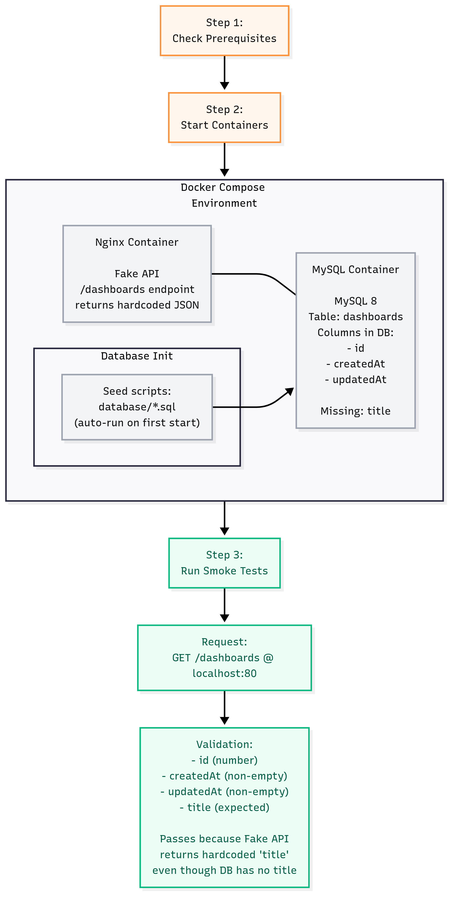
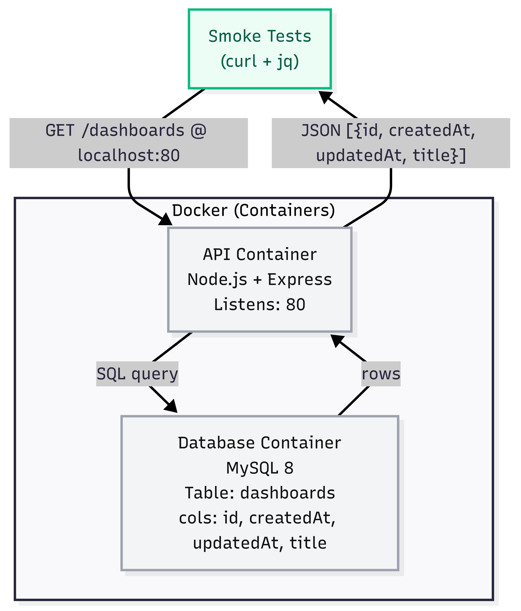

## 1) Overview
This project provides an Express.js API that exposes a `/dashboards` endpoint backed by a MySQL database. The service is containerised with Docker and includes health checks, Swagger documentation, and smoke tests.

## 2) Architecture
The environment consists of:
- **API container** (Node.js + Express, port 3000 → exposed as host port 80)
- **Database container** (MySQL 8, seeded from `/database` scripts)

### Diagrams
Provided system:  


Implemented API flow:  



## 3) Tech Stack
- Node.js + Express
- MySQL (mysql2/promise)
- Docker & Docker Compose
- Swagger UI
- jq (for smoke tests)

## 4) Prerequisites
- [Docker](https://docs.docker.com/get-docker/)
- [Docker Compose](https://docs.docker.com/compose/)
- [jq](https://stedolan.github.io/jq/) (for smoke tests)

Run:
```bash
./check_prerequisites.sh
```

## 5) Quickstart

```bash
# 1) Start containers (API + DB)
docker compose up --force-recreate

# 2) Run smoke tests in another shell
./smoke_tests.sh
```

* API available at: [http://localhost](http://localhost)  
* Swagger docs: [http://localhost/docs](http://localhost/docs)  
  *Note: host port **80** is forwarded to container port **3000** for smoke tests.*

## 6) Endpoints

* `GET /dashboards` – list dashboards from DB
* `GET /health` – liveness check
* `GET /ready` – readiness check (DB connectivity)
* `GET /docs` – Swagger UI

## 7) Environment

Environment variables are defined in `.env` (see `.env.example`):

```
DB_HOST=
DB_PORT=
DB_USER=
DB_PASSWORD=
DB_NAME=
DB_CONN_LIMIT=1
PORT=
```

## 8) Database

* Table: `dashboards (id, createdAt, updatedAt, title)`
* Seed scripts auto-run from `./database/*.sql` when the DB container starts.
* To reapply changes:

```bash
docker compose down
docker compose up --force-recreate
```

## 9) Project Structure

```
api/
  config/        # db, swagger
  controllers/   # request handlers
  routes/        # routes
  services/      # db queries
  middlewares/   # error handling and validations 
  utils/         # helpers
  app.js         # express app
  index.js       # server start
database/        # init + seed sql
public/          # diagrams (provided.png, api.png)
docker-compose.yml
smoke_tests.sh
```

## 10) Notes on Quality

* Connection pooling with `mysql2/promise`
* Centralised error handling middleware
* Health & readiness endpoints
* Consistent ISO 8601 date formatting
* API documentation with Swagger
